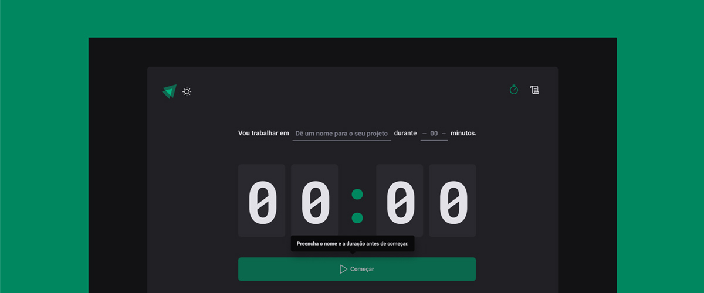

<h1 align="center">
  
</h1>

<p align="center">
  
  
  
</p>

<h1 align="center">
  Pomodoro
</h1>
<p align="center">Timer para controle de ciclos de atividades.</p>

<p align="center">
  <a href="#-sobre-o-projeto">Sobre o Projeto</a> •
  <a href="#-tecnologias">Tecnologias</a> •
  <a href="#-configurando-o-ambiente">Configurando o Ambiente</a> •
  <a href="#-trabalhos-futuros">Trabalhos Futuros</a> •
  <a href="#-licença">Licença</a>
</p>

## 📌 Sobre o projeto

Está aplicação foi desenvolvida para auxiliar o usuário a aplicar o método de gerenciamento de tempo conhecido como Pomodoro. Inicialmente o usuário terá acesso a uma tela contendo um timer e poderá por meio de um formulário cadastrar um novo ciclo de atividade, após o início do ciclo, o mesmo pode ser interrompido caso o usuário pressione o botão antes que o timer chegue a zero. O histórico contendo todos os ciclos finalizados, interrompidos e o atual ciclo em adamento pode ser acessado pelo menu no topo direito da aplicação.

---

## 🧩 Tecnologias

- [ReactJS](https://reactjs.org/)
- [Typescript](https://www.typescriptlang.org/)
- [React Router](https://reactrouter.com/)
- [React Hook Form](https://react-hook-form.com/)
- [Styled Components](https://styled-components.com/)
- [Phosphor Icons](https://phosphoricons.com/)
- [Date FNS](https://date-fns.org/)
- [Immer](https://github.com/immerjs/immer)
- [Zod](https://github.com/colinhacks/zod)
- [Vite](https://vitejs.dev/)

---

## 🌱 Configurando o ambiente

### 🚧 **Requisitos**

> Será necessário instalar os itens abaixo para clonar e executar o projeto corretamente!

- [Git](https://git-scm.com)
- [Node](https://nodejs.org)

### ⏩ **Clonando e executando a aplicação**

```bash
# Primeiro clone o repositório utilizando git:
$ git clone https://github.com/diegonatalo/pomodoro.git

# Depois acesse a pasta do projeto:
$ cd pomodoro

# Em seguida instale as dependências:
$ npm i

# Por fim, inicie a aplicação:
$ npm run dev
```

---

## 💭 Trabalhos futuros

- Desenvolver tema claro para a interface
- Adicionar a opção "Troca de tema" no topo esquerdo da aplicação

---

## 📜 Licença

Distribuído sob a licença MIT. Veja [LICENSE](LICENSE) para mais informações.

---

<p align="center">Feito com ❤️ por Deigo Natalo!</p>
